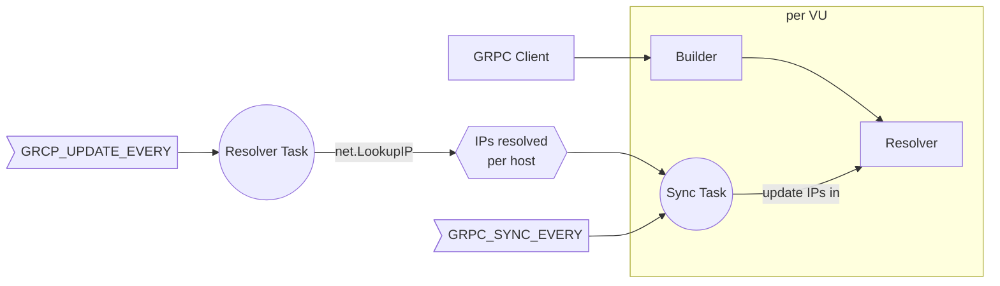

# xk6-grpcresolver

The `xk6-grpcresolver` is a plugin for the k6 load testing tool that resolves a gRPC balanced host to its individual replicas, detecting updates in the available replicas while the test is running.

## Why?

Considering a scenario where we have a gRPC service with N replicas, and a hostname that resolves to these replicas: when using the [k6 gRPC client (`k6/net/grpc`)](https://grafana.com/docs/k6/latest/using-k6/protocols/grpc/), it internally resolves the IPs for all the replicas just when calling the `client.connect` method.

However, if new replicas are deployed while the test is running, these new replicas will not be used by the test. The `xk6-grpcresolver` plugin solves this issue by detecting updates in the available replicas while the test is running, and using the new replicas in the test. This includes new replicas and replicas that are removed.

## Install

### Pre-built binaries

```bash
make run
```

### Build from source

```bash
make build
```

## Usage

The plugin is always enabled when running a k6 binary compiled with this plugin, and specifying the URL of the gRPC service prefixed by `k8s:///` (this can be changed with the `GRPC_RESOLVER_PROTOCOL` environment variable). See the [examples](examples) for more details.

There are some attributes that can be configured with the following environment variables:

| Key                      | Description                                                                                                                                                                   | Default  |
|--------------------------|-------------------------------------------------------------------------------------------------------------------------------------------------------------------------------|----------|
| `GRPC_RESOLVER_PROTOCOL` | Set the protocol name that will trigger the plugin to work for a connection, if its URL has this protocol name.                                                               | `k8s`    |
| `GRCP_UPDATE_EVERY`      | Periodicity at which query the list of IPs for the hostnames. Value must comply with [Go time.ParseDuration](https://pkg.go.dev/time#ParseDuration) format.                   | `3s`     |
| `GRPC_SYNC_EVERY`        | Periodicity at which synchronize the resolved IPs with the gRPC clients per VU. Value must comply with [Go time.ParseDuration](https://pkg.go.dev/time#ParseDuration) format. | `3s`     |
| `GRPC_DEBUG_LOGS`        | If `true`, show debug logs.                                                                                                                                                   | Disabled |

### Technical details

The k6 gRPC client connects (one client is connected per VU), the `Builder` is executed. The `xk6-grpcresolver` plugin overrides the default `Builder` with a custom one, which uses a custom `Resolver`.

The `Resolver` resolves the client's hostname to a list of IPs, which is retrieved periodically. This is performed from two tasks which run periodically in background:

- The **Resolver Task** resolves the hostname to the IP/s. This task is unique for each hostname, and shared between all the VUs. The periodicity at which this task runs is determined by the `GRCP_UPDATE_EVERY` environment variable.
- The **Sync Task** synchronizes the IP/s resolved for the hostname by the **Resolver Task**. This task is attached to each `Resolver`, thus each VU and hostname has its own **Sync Task**. The periodicity at which this task runs is determined by the `GRPC_SYNC_EVERY` environment variable.


